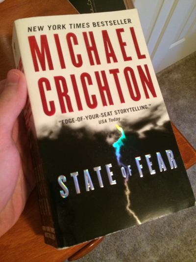

# Learning AR stuff with Python+OpenCV

----

### `ar_overlay_2d.py` - 2D AR Overlay of a Query in a Target Image

Find a `query_image` in a `target_image` and do best to replace found query with `ar_image`.

#### Inputs

`query_image`                | `target_image`                 | `ar_image`
:---------------------------:|:------------------------------:|:--------------|
  |    | 

#### Output

